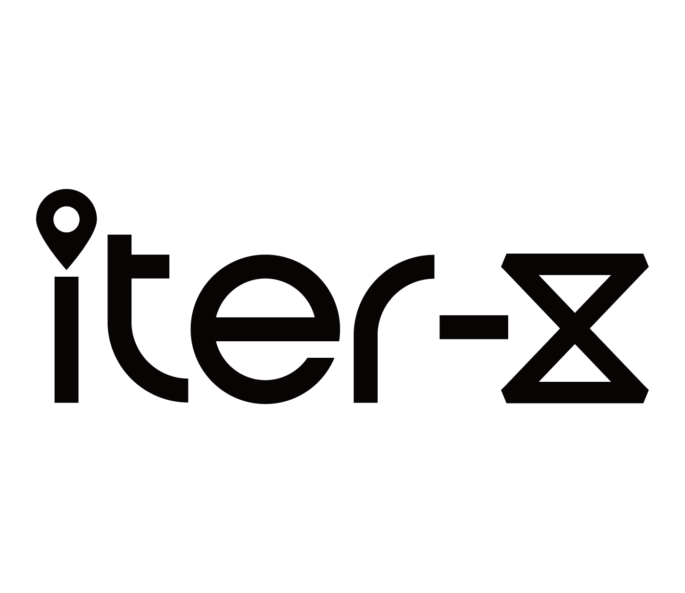

  

| [English](https://github.com/Iter-X/Iter-X) | [中文简体](docs/README.zh-CN.md) |

---

Iter-X is an AI-powered smart travel planning app designed to evolve from a tool-oriented platform to a combined tool + community platform based on the open-source community. Users can quickly generate personalized travel itineraries, browse, share, and copy others’ plans, and explore popular destinations and trends. This simplifies the traditionally tedious travel preparation process for effortless and enjoyable planning.

## Key Features

1. **Smart Itinerary Planning**: Plan trips quickly using voice interaction.
2. **Map Visualization**: Visualize the relationships between itinerary points on a map for a comprehensive journey overview.
3. **Social Interaction**: Comment, share, and copy others’ itineraries to spark new ideas.
4. **Hotspot Exploration**: Discover the latest trending destinations through community-driven insights.

## Vision

To become the go-to platform for travel planning, ensuring that Iter-X is the first thought for users when planning their trips.

## Join Us

We are a loosely connected remote collaboration team driven by passion. Our goal is to contribute valuable projects to the open-source community, inspiring others to create interesting products or solutions. At the same time, we warmly welcome individuals who are passionate and dedicated to joining us. Whether your motivation comes from a love for open source, a desire for personal growth and recognition, material rewards, exploring commercial opportunities, or simply connecting with like-minded individuals, as long as you can contribute, you are welcome to be part of our team.

Our team extends beyond technical roles. In addition to developers, we also have professional designers who need contributions from various non-technical roles. If this project excites you, we welcome your participation. We embrace every passionate individual with an open mind to build a promising future together.

## Contributor

We welcome more developers to join us! You can start from the following two aspects:

* [GOPHER.md](docs/dev/GOPHER.md)
* [DEV.md](docs/dev/DEV.md)
