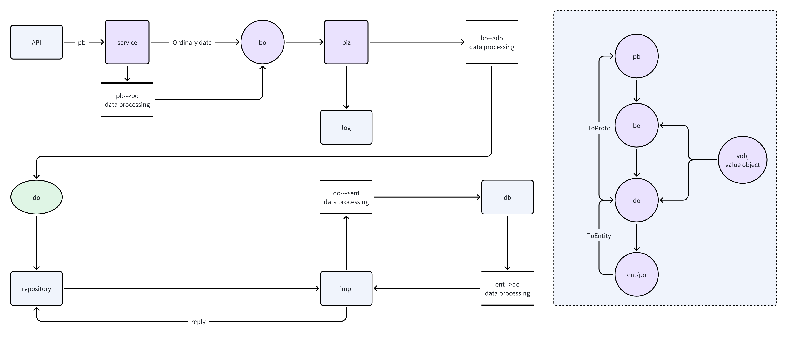

<div align="center">
  
</div>

<div align="center">

| [English](DEV.md) | [中文简体](DEV.zh-CN.md) |

</div>

# 写在前面

在开发前，请确保你已经阅读了[README.md](../README.zh-CN.md), 以及[GOPHER.md](./GOPHER.zh-CN.md), 前者帮助你了解`iter-x`, 后者给你一些关于此项目的编程经验和团队规范

# 环境篇

## 1. protoc 安装

### mac os

```bash
# 安装
brew install protobuf
# 验证
protoc --version
```

### windows

**命令行安装**

打开命令提示符或 PowerShell。

```bash
# 安装
choco install protoc
# 验证
protoc --version
```

**手动安装**

下载适用于 Windows 的预编译二进制文件：
[protobuf releases](https://github.com/protocolbuffers/protobuf/releases)

解压并将 protoc.exe 添加到系统环境变量 PATH 中。

### linux

**Ubuntu/Debian：**

```bash
# 安装
sudo apt-get update
sudo apt-get install protobuf-compiler
# 验证
protoc --version
```

**Fedora/CentOS/RHEL：**

```bash
# 安装
sudo yum install protobuf-compiler
# 验证
protoc --version
```

## 2. 项目环境依赖

### go版本

* go版本 >= 1.24.1

### 相关插件安装

```bash
make init
```

### 项目初始化

```bash
make all  
```

# 开发篇

本项目采用mini [DDD](https://www.google.com/search?q=DDD) 设计思想，总共分为以下几个模块

* API
  * proto
  * pb
* service
* biz
  * bo
  * do
  * repository
* data
  * cache
  * db
  * impl



## 依赖倒置

正确的调用关系是：

`service` -> `biz` -> `repository` -> `impl` -> `data`

## 事物管理

> biz 层使用事务管理

* repository 定义

```go
// Transaction wrapper interface
type Transaction interface {
	// Exec Transaction execution
	Exec(context.Context, func(ctx context.Context) error) error
}
```


