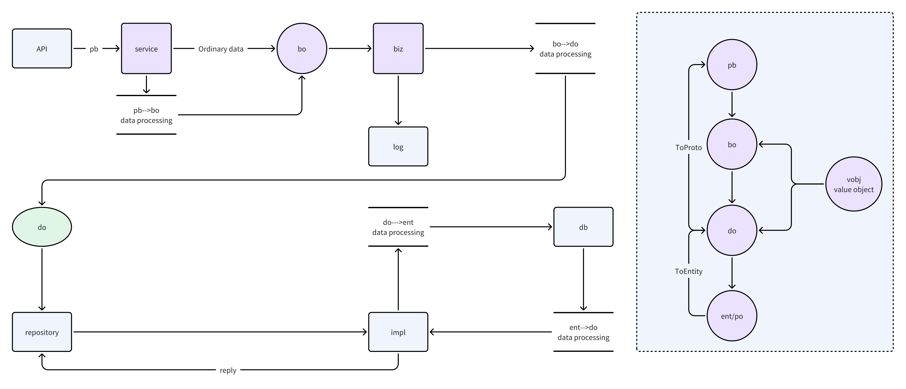

<div align="center">
  
</div>

<div align="center">

| [English](SERVER.md) | [中文简体](SERVER.zh-CN.md) |

</div>

# Preface

Before starting development, please ensure you have read [README.md](../../README.md) and [GOPHER.md](GOPHER.md). The former helps you understand `Iter-X`, while the latter provides programming experience and team guidelines for this project.

# Environment Setup

## 1. protoc Installation

### MacOS

```bash
# Install
brew install protobuf
# Verify
protoc --version
```

### Windows

**Command Line Installation**

Open Command Prompt or PowerShell.

```bash
# Install
choco install protoc
# Verify
protoc --version
```

**Manual Installation**

Download the precompiled binary for Windows:
[protobuf releases](https://github.com/protocolbuffers/protobuf/releases)

Extract and add protoc.exe to your system's PATH environment variable.

### Linux

**Ubuntu/Debian:**

```bash
# Install
sudo apt-get update
sudo apt-get install protobuf-compiler
# Verify
protoc --version
```

**Fedora/CentOS/RHEL:**

```bash
# Install
sudo yum install protobuf-compiler
# Verify
protoc --version
```

## 2. Project Environment Dependencies

### Go Version

* Go version >= 1.24.1

### Plugin Installation

```bash
make init
```

### Project Initialization

```bash
make all
```

# Development

This project adopts a mini DDD design philosophy, divided into the following modules:

* API: Interface layer, which includes HTTP, gRPC, and other interface definitions
    * proto
    * pb
* service: Service entry point, which connects the API (Server) and biz layers, typically performing tasks like parameter validation, conversion, etc.
* biz: Business logic layer, which contains the implementation of business logic
    * bo
    * do
    * repository
* data: Data access layer, responsible for handling resources like databases, external data, and external services
    * cache
    * db
    * impl



## Dependency Inversion

The correct calling relationship is:

`service` -> `biz` -> `repository` -> `impl` -> `data`

It is important to note that each layer involves data structure transformation, meaning each layer only cares about the data structures it receives. For example:
- The `service` layer only cares about the data structures in the `pb` package, which are the `req` and `resp` generated by `proto`. When the `service` layer calls the `biz` layer, it will convert the `pb` to `bo`.

## Transaction Management

> Transaction management is handled at the biz layer.

* Repository Definition

```bash
// Transaction wrapper interface
type Transaction interface {
	// Exec Transaction execution
	Exec(context.Context, func(ctx context.Context) error) error
}
```
